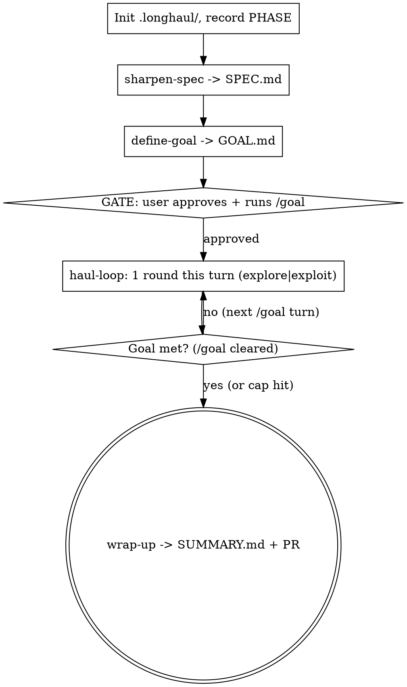

# long-haul

## What this is

The **orchestrator**: the interactive Claude session the user runs. It drives a
four-phase arc that forces work across the **long horizon** — a loop that does
not stop until a measurable goal holds. You advance automatically, halting only
at two human gates.

The phases are sibling skills; invoke each in turn:

1. `sharpen-spec` — turn the ask into a well-defined **spec** with a transcript-demonstrable success signal and a declared **toolbox** (the skills + MCP the haul may use). If the ask is vague, grill it first.
2. `define-goal` — forge a `/goal`-ready completion condition from the spec. **GATE: user approves + runs `/goal`.**
3. `haul-loop` — each `/goal` turn, run one round: decide **explore vs exploit**, implement the attempt in a worktree, keep it only if it beats the **incumbent**. Repeat until the goal clears.
4. `wrap-up` — once the goal clears (or the cap trips), report goal-vs-achieved and open a PR. **GATE: user confirms.**

**You are the orchestrator and the implementer.** Unlike a race, there is one
pair of hands — yours. The leverage is not a second agent; it's the
**explore/exploit** discipline and the ratcheting incumbent that keep a long run
from drifting.

## The /goal mechanic (read this — the whole haul hinges on it)

`/goal <condition>` is a Claude Code built-in (v2.1.139+): it sets a completion
condition, and after every turn a fast model checks the transcript to decide
whether it holds. If not, it starts another turn automatically; when it holds,
the goal **auto-clears**. Two consequences shape this skill:

- **Slash commands are user-invoked.** You cannot type `/goal`, `/grill-me`, or `/implement` yourself. Where the arc needs one, you either run its model-invocable equivalent (the `grilling` skill) or follow its contract inline (the `/implement` contract, executed by you inside each `/goal` turn). `/goal` itself is a hard gate — `define-goal` produces the exact line and the user runs it.
- **The evaluator only reads the conversation** — it runs no tools. So every round `haul-loop` must *surface the goal's stated check output in chat*. A goal whose proof never lands in the transcript loops forever.

Once `/goal` is active it re-invokes you turn after turn. Your standing job each
turn is **at most one haul-loop round** — `ROUND` in `STATE.md` is the source of
truth, so a turn that does zero or (accidentally) two doesn't desync the count.
When the condition is met `haul-loop` records `STATUS: GOAL-MET` and the goal
clears — then proceed to `wrap-up`.

## Flow

## On invocation

1. **Preflight** (next section). Stop on a hard failure; flag a soft one with the phase it will **block at**.
2. **Resume vs fresh.** If `<REPO>/.longhaul/STATE.md` exists, read `PHASE`/`STATUS` and jump to that phase — do not restart. Otherwise create `.longhaul/` **under the target repo** (`REPO`, resolved in preflight), append `.longhaul/` to its `.gitignore`, write `STATE.md` (`PHASE: spec`, `STATUS: ACTIVE: orchestrator`, `ROUND: 0`, `ROUNDS: 8`, `MODE: -`, `STALL: 0`, `STALL_CAP: 2`, `INCUMBENT: none`, `SCORE: none`, `REPO: <abs path>`, `BASE: <REPO's git short-sha>`, `GATES: approve_goal=required confirm_pr=required`, `GOAL: pending`), and record the user's ask.
3. **Drive the phases in order**, invoking each sibling skill. Update `PHASE` as you cross each boundary so a re-invocation resumes cleanly. If the user gave no ask, don't enumerate the spec questions yourself — go straight into `sharpen-spec`, which collects them via tabbed `AskUserQuestion` calls.

## Preflight

Everything a later phase needs, checked before it's too late to fix cheaply. A
*hard* failure stops the run; a *soft* one is flagged with the phase it will
**block at** — say "this will block at X" rather than letting the user discover
it after they've disconnected.

1. **Git** — `git rev-parse --git-dir`. Worktrees need it. Missing → stop.
2. **Target repo.** The deliverable's repo may differ from the invocation cwd. If the ask names a file, a PR, or an artifact ("the DAG") that lives outside cwd, or sibling git repos sit alongside it, **ask which repo owns the deliverable** before writing any state. That repo is `REPO`; **all `.longhaul/` state, `BASE`, worktrees, the incumbent branch, and the eventual PR live under it**, not cwd. Default `REPO` to cwd's repo toplevel when they're the same.
3. **Resolve "this PR".** If the ask says "this PR" / "the PR", it has no referent until you pin it: in `REPO`, `gh pr view` for the current branch, else `gh pr list --search`. **Echo the resolved PR (number, title, base) back for confirmation** before sharpening — the branch you're on may have no PR while a sibling branch at the same SHA does.
4. **/goal availability** — Claude Code ≥ v2.1.139. Missing → offer to run the loop manually with a round cap instead.
5. **Wrap-up deps.** `wrap-up` opens a PR, so verify now, not at the end: `gh` present + authed (`gh auth status`), `REPO`'s remote reachable, push permission. Missing → soft-flag "blocks at wrap-up".
6. **Detach readiness** *(only if the run is meant to go unattended — foreground Auto-mode or `--background`)*. An unattended haul that hits any interactive stop parks until a human returns, so confirm the whole path is clear:
   - **Auto mode on** — `/goal` only auto-runs turns with it; otherwise every tool call prompts. (Foreground only.)
   - **Hooks not disabled** — `/goal` is off under `disableAllHooks` / `allowManagedHooksOnly`.
   - **`confirm_pr=auto`** in `GATES` — the default `required` parks forever before the PR.
   - **Background only:** `check.sh` written, `haul_bg_start` available (`reference/haul-bg.sh`), host stays powered.
   Any unmet item → name it and the step it blocks at.
7. **Toolbox reachability + cost.** The spec's toolbox may name heavy or paid
   means — an MCP server (is it authed and responding?), an external/prod runner
   (SageMaker, a deploy target), a live DB. Two things to surface now: (a) any
   tool the haul will need but **can't reach** (unauthed MCP, missing CLI) →
   soft-flag with the phase it blocks at; (b) any toolbox step that **spends real
   money or mutates production** — typically the acceptance gate (`GOAL.md`) — →
   say so plainly ("this haul will incur prod compute at the acceptance gate"), so
   the user opts into the cost before the loop, not after a surprise bill. A long
   autonomous run that fires paid infra is not bounded by the per-round worktree.

## The two gates — never skip these

| Gate | When | What you do |
|---|---|---|
| **approve-goal** | after `define-goal` | Show `GOAL.md`'s condition and the `/goal …` line. Wait for the user to edit/approve and to actually run `/goal`. Do not start hauling until the goal is active. |
| **confirm-pr** | in `wrap-up` | Show the branch name + commit list + PR body. Only push/open after the user confirms — *unless* `GATES` sets `confirm_pr=auto`. |

Set `STATUS: WAITING-USER: <gate>` while waiting so a resume knows it's parked on a human.

**Gate policy.** `GATES` in `STATE.md` sets each gate's mode. `approve_goal` is
always `required` — only the user can run `/goal`. `confirm_pr` is `required`
(default — `wrap-up` parks for a yes) or `auto` (for an unattended finish —
`wrap-up` opens a *draft* PR without parking and never pushes to a protected or
default branch). Set `confirm_pr=auto` only once the user has accepted an
unattended finish.

## Phase ownership

Each phase's mechanics live in its own skill — invoke it, don't reimplement it:

- `sharpen-spec` writes `SPEC.md` (the deliverable, the success signal, the toolbox, constraints).
- `define-goal` writes `GOAL.md` (+ the `/goal` line) from `SPEC.md`.
- `haul-loop` runs one explore-or-exploit round per `/goal` turn against `GOAL.md`, writes `R<N>.md`, and ratchets the `INCUMBENT`.
- `wrap-up` writes `SUMMARY.md`, then commits on a branch and opens the PR.

State-file templates live in [reference/file-formats.md](reference/file-formats.md).

## Termination & escape hatches

- **Normal:** goal clears → `haul-loop` sets `STATUS: GOAL-MET` → `wrap-up` → user confirms → PR opened → `STATUS: DONE`.
- **Round cap hit, or the well is dry** (`haul-loop`'s own stopping conditions): it sets `STATUS: WAITING-USER: cap-decision` and surfaces a partial against the incumbent. Decide with the user whether to raise `ROUNDS`, accept (→ `wrap-up`), or stop. (Definitions live in `haul-loop`; don't restate them here.)
- **Git unavailable / `/goal` unavailable:** `STATUS: BLOCKED: <reason>`, surface, stop.
- Always tear down the attempt worktree before exiting on any path (`git worktree prune`).

## Resuming

`/long-haul` with an existing `.longhaul/`: read `STATUS`. **First check
`.longhaul/bg.pid`** — if it names a live process, a background driver owns the
haul; this session is read-only. Show `haul_bg_status` (tail of `PROGRESS.log`)
and either watch or `haul_bg_stop` before taking over. Otherwise dispatch on `STATUS`:
- `ACTIVE: orchestrator` → resume the phase named by `PHASE` (`spec`→sharpen-spec, `goal`→define-goal, `haul`→haul-loop, `wrap`→wrap-up) from the top; the phases are re-entrant (e.g. a haul interrupted mid-grilling just re-asks).
- `WAITING-USER: <gate>` → re-present that gate (`approve-goal`, `confirm-pr`, or `cap-decision`).
- `HAULING: R<n>` → an attempt may be mid-flight in `.longhaul/attempt/`; check it, judge if done, else continue it. Don't start a second attempt for the same round.
- `GOAL-MET` → the loop is done and the goal holds; go straight to `wrap-up`.
- `BLOCKED` → report what's blocked.
- `DONE` → show `SUMMARY.md`.
