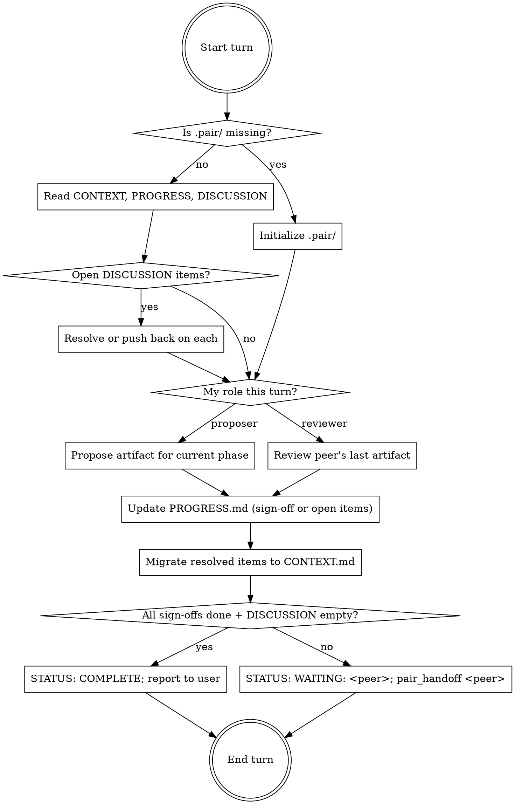

# pair-coding

## TL;DR for a cold-woken peer

You were just invoked via `codex exec` or `claude -p` with a prompt like *"Resume the pair-coding skill. Read .pair/PROGRESS.md..."*. Do this, in order:

1. `cat .pair/PROGRESS.md .pair/CONTEXT.md .pair/DISCUSSION.md` — orient.
2. Confirm `STATUS: WAITING: <you>`. If it says the peer instead, something's wrong — surface to user, do not start a turn.
3. Run the turn protocol below.
4. End the turn with either `STATUS: COMPLETE` (and stop) or `pair_handoff <peer>` (see Handoff).

The peer reads everything in `.pair/` cold — assume zero session memory. State that needs to persist goes into `CONTEXT.md`.

## Overview

Two coding agents work on the same task. Every artifact (spec, plan, each code change) is proposed by one and reviewed by the other. Shared state lives in `.pair/` at the repo root. The active agent invokes its peer via CLI when handing off; nothing advances until both have signed off.

**Core principle:** No artifact is "approved" until both agents have signed off in `PROGRESS.md`. Disagreements are written to `DISCUSSION.md` and resolved iteratively — never by silently overwriting the peer's work.

**Violating the letter of these rules is violating the spirit.** If you find yourself rationalizing "this is small enough to skip the sign-off" or "I'll just edit the peer's spec instead of opening a discussion item," stop. The mutual review IS the point.

## When to use

- User typed `/pair-coding <task>` (new session) or `/pair-coding` (resume `.pair/`).
- User wants mutual review at every stage (spec → plan → each code step), not just on the final diff.
- You were invoked as the peer by the active agent.

**Don't use for:**
- Solo work (use TDD / writing-plans).
- One-shot review of completed code (use `code-review` or `review-markdown-plan`).
- Sessions where only one of `claude` or `codex` is installed (`command -v` first).

## Shared state in `.pair/`

Three persistent files plus per-artifact files. Read full templates and field reference at [reference/file-formats.md](reference/file-formats.md). Quick summary:

| File | Purpose | Updated by |
|---|---|---|
| `PROGRESS.md` | State machine: `STATUS`, `TURN`, `PHASE`, `STEP`, `NEXT_PROPOSER`, sign-offs, turn log | Every turn |
| `CONTEXT.md` | Agreed-on facts: task, constraints, glossary, resolved decisions | When something resolves |
| `DISCUSSION.md` | Open disagreements only | Reviewer disagrees; cleared when resolved |
| `SPEC.md` / `PLAN.md` / `STEP-N.md` | The artifacts under review | Proposer of that phase/step |
| `turn-N-<peer>.log` | Captured stdout of detached peer invocations | `pair_handoff` |

Initialize `.pair/` on turn 1 and append `.pair/` to `.gitignore`.

## The loop



## Turn protocol — do this every turn

1. **Identify yourself.** Are you Claude Code or Codex? Your peer is the other. Confirm peer CLI exists: `command -v codex` or `command -v claude`. If missing, `STATUS: BLOCKED`, do not hand off.
2. **Read state.** All three: `PROGRESS.md`, `CONTEXT.md`, `DISCUSSION.md`. If `.pair/` is missing, this is turn 1 → see [reference/file-formats.md](reference/file-formats.md) for initialization templates.
3. **Address open `DISCUSSION` items first.** For each: (a) accept and move the conclusion to `CONTEXT.md → ## Resolved decisions`, deleting it from `DISCUSSION.md`; or (b) push back inline with new reasoning. Resolutions block new artifacts.
4. **Do your role:**
   - **Proposer:** produce the artifact for the current phase (see Phases below).
   - **Reviewer:** read the peer's last artifact. Sign off in `PROGRESS.md` OR open new `DISCUSSION` items. **Do not silently rewrite the proposer's artifact** — edits belong to the proposer post-resolution.
5. **Update `PROGRESS.md`.** Bump `TURN`, append a turn log row, update sign-offs, set `STATUS` and `NEXT_PROPOSER`.
6. **Sweep `DISCUSSION.md`.** Resolved items must already be in `CONTEXT.md`; **delete the item's section entirely** from `DISCUSSION.md`. Annotating it in place (e.g. *"Status: RESOLVED"*) does not count as deletion — the file must contain only open items.
7. **Hand off OR complete:**
   - All signed off, `DISCUSSION.md` empty, tests pass → `STATUS: COMPLETE`, report to user. **Do not invoke peer.**
   - Otherwise → `STATUS: WAITING: <peer>`, then `pair_handoff <peer>` (see Handoff).

## Phases

- **Spec** — proposer writes `.pair/SPEC.md`. Reviewer signs off or opens items. Loop.
- **Plan** — proposer writes `.pair/PLAN.md` (numbered steps; each names files touched and the test that proves it). Loop.
- **Code** — for each numbered step, proposer implements + runs the named test + writes `.pair/STEP-N.md`; reviewer reads `git diff` plus `STEP-N.md`. **Do not advance to step N+1 until step N is signed off.**

Full templates: [reference/file-formats.md](reference/file-formats.md).

### Role rotation
Alternate the proposer role by phase, and within the code phase alternate by step. Set `NEXT_PROPOSER` so the peer knows immediately.

### Compressed turns

If you sign off on the current artifact AND you are `NEXT_PROPOSER` for the next (e.g., you're codex reviewing claude's spec and codex is the planned proposer of `PLAN.md`), do both in one turn. Record both actions in a single turn-log row.

**The invariant:** every artifact has been reviewed by someone other than its proposer. Compression preserves this — you're never reviewing your own work, just back-to-back roles for the same agent.

**Never compress two proposals of your own.** If you just proposed, the next turn is the peer's, full stop.

## Handoff

After writing `STATUS: WAITING: <peer>` to `PROGRESS.md`:

```bash
# In bash, from the repo root:
source ~/.claude/skills/pair-coding/reference/handoff.sh  # or ~/.agents/... if you're codex
pair_handoff codex                                         # or: pair_handoff claude
```

`pair_handoff` fires the peer via `nohup … &; disown` so it runs detached — your turn returns control immediately. Output lands in `.pair/turn-<N>-<peer>.log` **and** is appended to `.pair/session.log` (a single rolling feed that survives turn boundaries — see Human steering below). The user's original session is free; the loop runs in background.

See [reference/handoff.sh](reference/handoff.sh) for the source, and [reference/file-formats.md](reference/file-formats.md) for the log-file convention.

If you need to invoke manually (no bash available), the equivalents are:

```bash
# Claude Code → Codex
nohup codex exec -s workspace-write -C "$(pwd)" --skip-git-repo-check \
  "Resume the pair-coding skill. Read .pair/PROGRESS.md and continue from STATUS: WAITING: codex." \
  > .pair/turn-${TURN}-codex.log 2>&1 & disown
```

```bash
# Codex → Claude Code  (flags MUST come before the prompt; `--` ends the
# variadic --add-dir, otherwise claude eats the prompt as a directory)
nohup claude -p --dangerously-skip-permissions --add-dir "$(pwd)" -- \
  "Resume the pair-coding skill. Read .pair/PROGRESS.md and continue from STATUS: WAITING: claude." \
  > .pair/turn-${TURN}-claude.log 2>&1 & disown
```

## Human steering — watching and intervening live

The whole point of detached handoffs is that the user keeps their terminal. They can watch the loop in real time and steer it without restarting from scratch. Source the helpers, then:

```bash
source ~/.claude/skills/pair-coding/reference/handoff.sh   # or ~/.agents/...
```

| Command | What it does |
|---|---|
| `pair_watch` | `tail -F .pair/session.log`. Single feed that survives turn boundaries — turn headers (`=== T5 codex === ...`) mark the transitions. Ctrl-C to exit. |
| `pair_status` | One-screen summary: current `STATUS`/`TURN`/`PHASE`/`STEP`/`NEXT_PROPOSER`, open `DISCUSSION` items, last 20 lines of `session.log`. Cheap; safe to run any time. |
| `pair_inject "<message>"` | Append a `[USER INPUT]` discussion item to `DISCUSSION.md`. The next agent will address it before continuing the current artifact (the turn protocol's *"open DISCUSSION items first"* rule). Use this to ask a question, flag a concern, or redirect — without halting the loop. |
| `pair_constraint "<text>"` | Append a bullet to `CONTEXT.md → ## Constraints`. Both agents read CONTEXT at the start of every turn, so this becomes binding for every subsequent turn. Good for *"never use library X"* or *"keep the public API stable"* style guardrails added mid-flight. |
| `pair_takeover` | Kill the running peer by PID (found via `lsof` on `.pair/turn-*.log` — never killall), set `STATUS: BLOCKED: human-takeover`. The loop pauses; you can edit code directly. |
| `pair_resume <peer>` | After `pair_takeover` + manual work, set `STATUS: WAITING: <peer>`, bump `TURN`, fire `pair_handoff`. The loop continues with the changes you made baked in. |

**Mental model:** `.pair/` is a shared whiteboard. The agents read it and write to it constantly; the user can write on it too — that's the supported way for a human to be in the loop. The conversation itself isn't joinable (each peer runs headless); the artifacts are.

**Latency note.** `pair_inject` and `pair_constraint` append to files the *next* turn will read. If the active peer has already loaded those files for the current turn, your edit takes effect one turn later. To force immediate effect, `pair_takeover` first, then edit, then `pair_resume`.

## Hazards

These are real bugs the skill was patched for during live testing. Do not relearn them.

| Hazard | What goes wrong | Rule |
|---|---|---|
| **`claude -p "<prompt>" <flags>`** (flags after prompt) | Claude CLI hangs indefinitely instead of erroring. Codex made this mistake and stalled the whole session. | Always: `claude -p <flags> "<prompt>"`. The `pair_handoff` helper enforces this — prefer it. |
| **`claude --add-dir <dir> "<prompt>"`** (variadic flag eats prompt) | `--add-dir` accepts multiple values; without a `--` terminator the prompt is parsed as another directory, claude exits with *"Input must be provided"*, and the turn produces only an empty log. Latent for a long time because codex→claude handoffs failed silently while PROGRESS.md still looked plausible. | Always: `claude -p <flags> --add-dir "$(pwd)" -- "<prompt>"`. The `--` is required. The `pair_handoff` helper now enforces this. |
| **`claude -p --bare …`** | Errors `Not logged in · Please run /login` unless `ANTHROPIC_API_KEY` is set; `--bare` skips OAuth/keychain. | Don't pass `--bare`. Plain `--dangerously-skip-permissions` works for OAuth users. |
| **`killall claude` / `pkill codex` to recover from a hang** | Kills the user's primary interactive session. Codex tried this during testing. | Never blanket-kill by name. Use `pair_peer_status <peer>` to list PIDs, then surface to user. |
| **Invoking the peer as a "ping" check** (`claude -p "Reply with ok"`) | A full agent invocation can take 30s+ to start; you're not testing availability, you're starting a session. | The only availability check is `command -v <peer>`. Trust it; if the peer actually fails, you'll see it in the log file next turn. |
| **Synchronous `codex exec` / `claude -p` without `nohup … &`** | Peer's turn blocks your turn, processes deep-nest, user's terminal stays busy. | Always `nohup … &; disown` (or use `pair_handoff`). |

## Termination

Write `STATUS: COMPLETE` and **do not invoke peer** when all three hold:
- All sign-offs in `PROGRESS.md` are checked.
- `DISCUSSION.md` is empty.
- Tests for all implemented steps pass.

**Escape hatches** — write `STATUS: BLOCKED: <reason>`, do not invoke peer, surface to user:
- `TURN` exceeds 30 (looping).
- A single `DISCUSSION` item has flipped between agents 3+ times (structural disagreement).
- Peer CLI not installed.
- Tests fail 3 consecutive code-phase turns on the same step (stuck implementation).
- Peer process hung — use `pair_peer_status`, surface PIDs, do not kill by name.

## Common mistakes

| Mistake | Fix |
|---|---|
| Reviewer silently edits the proposer's artifact | Open a DISCUSSION item; the proposer edits after resolution. |
| Leaving resolved items in `DISCUSSION.md` (even marked *"RESOLVED"*) | Move the conclusion to `CONTEXT.md → ## Resolved decisions`, then **delete the item's section** from `DISCUSSION.md`. In-place annotation is not deletion — observed in pressure testing as the most common partial-compliance failure. |
| Advancing to step N+1 before step N is signed off | Block on the sign-off. One code step at a time. |
| Forgetting to bump `TURN` or append a turn log row | Both are how the peer reorients next turn. Always update. |
| Re-proposing the whole artifact for one open DISCUSSION item | Address the item only. Don't rewrite settled sections. |
| Skipping `.gitignore` for `.pair/` | `.pair/` is transient working state — never commit. |
| Treating sign-off as a formality (approving without reading the diff) | If you can't articulate what you checked, you didn't review. |

## Resuming

If `/pair-coding` is invoked with no args and `.pair/` exists, read `STATUS`. If `WAITING: <you>` → do your turn. If `WAITING: <peer>` → the loop is mid-flight; tail `.pair/turn-*-<peer>.log`, report to user, do **not** start a duplicate turn.

## Testing the skill itself

A smoke test lives at `.claude/skills/run-pair-coding/smoke.sh` (relative to this skill folder). Run `./smoke.sh --lint` for a free frontmatter + CLI check, or `./smoke.sh --smoke` to drive one real codex turn against a throwaway repo (~10¢).
