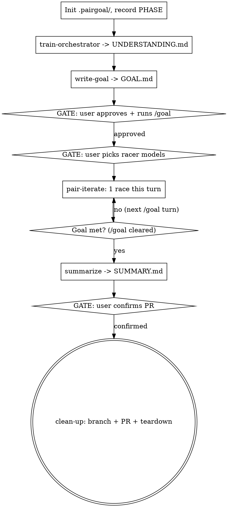

# pair-goal

## What this is

The **orchestrator**: the interactive Claude session the user runs. It drives a
five-phase improvement arc, advancing automatically and stopping only at three
human gates. The phases are sibling skills; you invoke each in turn:

1. `train-orchestrator` — understand what's wrong now and what "better" means.
2. `write-goal` — forge a `/goal`-ready completion condition. **GATE: user approves + runs `/goal`.**
3. `pair-iterate` — each `/goal` turn, race a Claude (chosen model) vs Codex (chosen model) in separate worktrees; judge + merge the winner. **GATE: user picks the two racer models, once.**
4. `summarize` — once the goal auto-clears, report goal-vs-achieved and the kept diff.
5. `clean-up` — commit on a branch and open a PR. **GATE: user confirms.**

**You are the orchestrator, not an implementer.** During iteration you never
edit the target code yourself — you commission two racers and keep the better
diff. Implementing it yourself defeats the second-opinion design.

## The /goal mechanic (read this — the whole arc hinges on it)

`/goal <condition>` is a Claude Code built-in (v2.1.139+): it sets a completion
condition, and after every turn a fast model checks the transcript to decide
whether the condition holds. If not, it starts another turn automatically; when
it holds, the goal **auto-clears**. Two consequences shape this skill:

- **Slash commands are user-invoked.** You cannot type `/goal` yourself.
  write-goal produces the exact line; you present it and ask the user to run it.
- **The evaluator only reads the conversation** — it runs no tools. So every
  round you must *surface the stated check's output in chat*. A goal whose proof
  never lands in the transcript will loop forever.

Once `/goal` is active it keeps re-invoking you turn after turn. Your standing
job each turn is **exactly one pair-iterate round**. When the condition is met
the goal clears and control returns to you — then proceed to summarize.

## Flow

## On invocation

1. **Preflight.** `command -v claude codex` (both required) and `git rev-parse --git-dir` (worktrees need git). Missing → tell the user, stop. Confirm `/goal` is available (Claude Code ≥ v2.1.139); if not, offer to run the loop manually with a round cap instead.
2. **Resume vs fresh.** If `.pairgoal/STATE.md` exists, read `PHASE`/`STATUS` and jump to that phase — do not restart. Otherwise create `.pairgoal/`, append `.pairgoal/` to `.gitignore`, write `STATE.md` (`PHASE: understand`, `STATUS: ACTIVE: orchestrator`, `ROUND: 0`, `ROUNDS: 5`, `ORCH_MODEL: <your model>`), and record the user's one-line ask.
3. **Drive the phases in order**, invoking each sibling skill. Update `PHASE` in `STATE.md` as you cross each boundary so a re-invocation resumes cleanly.

## The three gates — never skip these

| Gate | When | What you do |
|---|---|---|
| **approve-goal** | after write-goal | Show `GOAL.md`'s condition and the `/goal …` line. Wait for the user to edit/approve and to actually run `/goal`. Do not start iterating until the goal is active. |
| **pick-models** | before round 1 of pair-iterate | Ask which model the Claude racer uses (**must differ from `ORCH_MODEL`**) and which Codex model. Write `RACER_CLAUDE` / `RACER_CODEX`. pair-iterate owns the exact prompt. |
| **confirm-pr** | after summarize | Show the branch name + PR body. Only push/open after the user confirms. |

Set `STATUS: WAITING-USER: <gate>` while waiting so a resume knows it's parked on a human.

## Phase ownership

Each phase's mechanics live in its own skill — invoke it, don't reimplement it:

- `train-orchestrator` writes `UNDERSTANDING.md`.
- `write-goal` writes `GOAL.md` (+ the `/goal` line) from `UNDERSTANDING.md`.
- `pair-iterate` runs one race per turn against `GOAL.md`, writes `R<N>.md`, merges the winner. It uses `reference/handoff.sh` (`goal_race`/`goal_wait_race`/`goal_teardown`).
- `summarize` writes `SUMMARY.md` once the goal clears.
- `clean-up` commits, opens the PR, and tears down worktrees + `.pairgoal/`.

## Termination & escape hatches

- **Normal:** goal clears → summarize → user confirms → clean-up opens the PR → `STATUS: DONE`.
- **Round cap hit** (`ROUND` reaches `ROUNDS`) without the goal met: stop iterating, tell the user the goal was not met, go to summarize anyway (report partial), and ask whether to clear `/goal`, raise `ROUNDS`, or stop.
- **Two consecutive rounds where neither racer beats the base:** surface to the user; don't burn more rounds silently.
- **Racer CLI missing / git not available / `/goal` unavailable:** `STATUS: BLOCKED: <reason>`, surface, stop.
- Always `goal_teardown` worktrees before exiting on any path.

## Resuming

`/pair-goal` with an existing `.pairgoal/`: read `STATUS`.
- `WAITING-USER: <gate>` → re-present that gate.
- `RACING: R<n>` → a race may be mid-flight; `goal_status` / tail logs, judge if both done, else wait. Don't launch a duplicate race.
- `BLOCKED` → report what's blocked.
- `DONE` → show `SUMMARY.md`.
